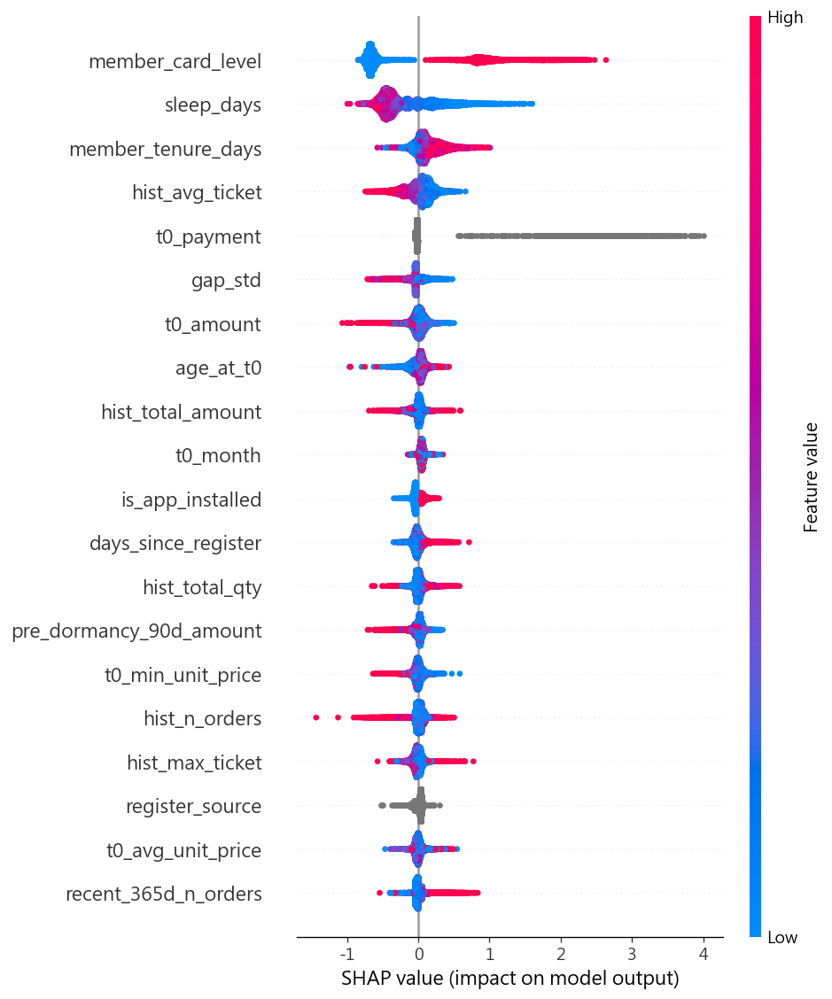
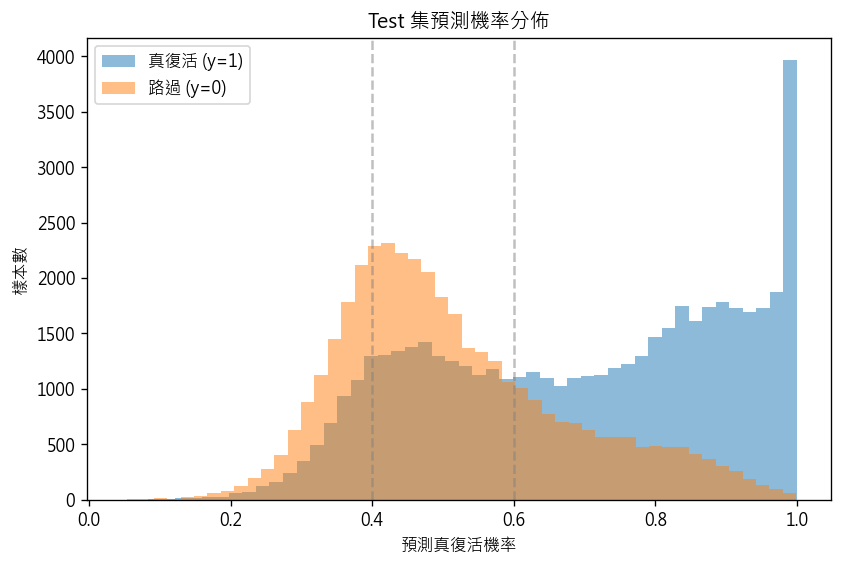
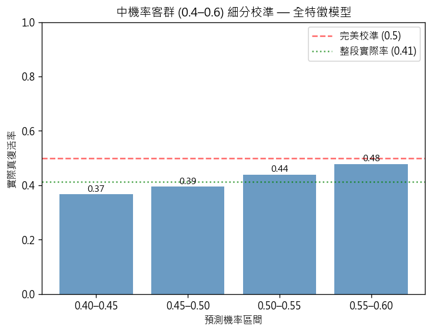

# shop#3 (DHC) 真復活預測 — 全流程總報告

> 專案：BDA2026 期末 — 91APP DHC 保健食品回流客戶預測
> 產出日期：2026-06-03
> 涵蓋階段：資料前處理 → 特徵工程 → 建模 → 結果分析

---

## 0. 專案概述

**問題定義**：DHC（91APP shop#3）是保健食品品牌，客戶會週期性補貨、也會週期性「沉睡」。
本專案要在一位沉睡客戶**回流下單的當下（t₀）**，預測他是「**真復活**」（會持續回購）還是「**路過**」（買完即走）。

**為何重要**：真復活與路過值得完全不同的行銷投資。能在 t₀ 當下分辨兩者，就能把行銷預算
精準投到「推一把就會留下」的中間客群（呼應 Proposal Q3 的三層分群）。

**標籤定義**：t₀ 之後 **120 天觀察窗**內若有 ≥1 次後續購買 → `y=1`（真復活），否則 `y=0`（路過）。

**四階段資產**：

| 階段 | 腳本 | 主要產出 |
|------|------|---------|
| 1. 前處理 | `preprocess_shop3.py` | `samples_shop3.parquet`（樣本骨架）、`data_preprocessing.md`、`pipeline_report.md` |
| 2. 特徵工程 | `feature_engineering.py` | `train/test_features.csv`（57 特徵）、`feature_engineering.md`、`feature_sanity.md` |
| 2.5 清理 | `clean_features.py` | 修正 `age_at_t0` / `days_since_register` 壞值 |
| 3. 建模 | `modeling.py` | `model/xgb_model.json`、`metrics.md`、SHAP、`modeling_report.md` |
| 4. 分析 | `analysis.py` | `model/results_analysis.md`、無快照對照模型、中機率校準分析 |

---

## 1. 資料前處理

從 91APP 全資料集（11,470,535 筆）篩出 shop#3，經 10 條規則（R1–R10）產生帶標籤的回流樣本骨架。

### 1.1 漏斗

| 步驟 | 筆數 | 說明 |
|------|------|------|
| 全資料集 | 11,470,535 | 5 個品牌混合 |
| shop#3 篩選（R1） | 4,938,006 | ShopId = `hFwniXiB/Ev2ZPXeO630Sw==`；會員 1,077,891 |
| 有效購買過濾（R2） | 4,653,006 | `StatusDef != Fail AND TotalSalesAmount > 0`，保留率 94.2% |
| 去重 TradesGroupCode（R3-1） | 4,652,898 | 標籤計算用（1 訂單 = 1 次購買） |
| 去重 (member, date)（R3-2） | 4,076,299 | Cᵢ 節奏計算用 |

### 1.2 核心方法：動態個人購物週期 Cᵢ → 沉睡門檻

- **Cᵢ（R4）**：每個購買間隔以「該間隔**之前**的歷史 gap 中位數」估計，**只用當下可知資訊**（避免靜態 Cᵢ 的時間洩漏）。Cᵢ 中位數 = 40 天，fallback = 67 天（DHC 全體 gap 中位數，對應 1–2 月補充週期）。
- **沉睡門檻（R5）**：`clip(3 × Cᵢ, 30, 365)`。gap 超過門檻 → 視為沉睡。
- **回流事件 t₀（R6）**：沉睡後的下一次購買即為回流事件。一位會員可貢獻多個 t₀（保健品為消耗品，反覆沉睡—回流屬常態）。共偵測 **511,800** 個回流事件。

### 1.3 防洩漏切分

- **標籤窗（R7）**：用精確時間戳記 `OrderDateTime > t0_order_datetime`，並排除 t₀ 訂單本身（雙重排除），徹底防止 t₀ 自計入復活。
- **Censoring（R8）**：剔除觀察窗超出資料截止日（2024-02-29）的樣本，即 `t₀ > 2023-11-01`，避免「資料不完整」被誤當成 y=0。保留 389,340 筆。
- **時序切分 + Embargo（R9）**：calendar 切分，train（t₀ ≤ 2023-03-31）與 test（t₀ ≥ 2023-07-29）之間留 120 天 embargo 緩衝帶（= 觀察窗長度），消除標籤窗跨 split 污染。

### 1.4 最終樣本

| Split | 樣本數 | t₀ 範圍 | y=1 比例 |
|-------|-------:|---------|--------:|
| train | 198,370 | 2022-02-03 ~ 2023-03-31 | **67.13%** |
| test  | 89,454 | 2023-07-29 ~ 2023-11-01 | **56.49%** |

> ⚠️ **train/test y=1 相差 10.6pp**：近期客戶留存率下降，屬真實的 distribution shift，是後續建模評估的重要背景（見 §4）。

📄 細節：[data_preprocessing.md](data_preprocessing.md) ｜ [pipeline_report.md](pipeline_report.md)

---

## 2. 特徵工程

對每筆樣本 join 主單 / 子單 / 商品頁 / 會員四張表，計算 **6 組共 57 個特徵**。

### 2.1 防洩漏鐵則

- 所有歷史特徵嚴格使用 `OrderDateTime < t0_date`（不含 t₀ 當天）。
- **唯一例外 = F2（t₀ 訂單本身）**：回流當下即可觀測，屬「當下特徵」非未來資訊。
- 全部以 merge + groupby 向量化計算，**無 per-row Python 迴圈**；分 10 批處理以控制 46M 筆 Order_TS 的記憶體峰值。

### 2.2 六大特徵組

| 組 | 數量 | 主題 | 代表特徵 |
|----|-----:|------|---------|
| **F1** | 17 | 歷史 RFM 與行為穩定性 | `sleep_days`、`hist_n_orders`、`hist_avg_ticket`、`personal_ci`、`gap_cv`、`hist_return_ratio` |
| **F2** | 12 | t₀ 訂單本身 | `t0_amount`、`t0_qty`、`t0_channel`、`t0_used_coupon`、`t0_is_big_promo` |
| **F3** | 7 | 商品行為 | `hist_distinct_salepages`、`t0_buys_familiar_product`、`t0_avg_unit_price` |
| **F4** | 8 | 會員背景 | `age_at_t0`、`days_since_register`、`gender`、⚠`member_card_level`（快照） |
| **F5** ⭐ | 8 | 跨期交互（最高優先） | `t0_vs_avg_ticket_ratio`、`sleep_vs_ci_ratio`、`t0_discount_vs_hist_ratio`、`t0_channel_matches_hist` |
| **F6** | 5 | 近期活躍窗口 | `recent_90/180/365d_n_orders`、`pre_dormancy_90d_amount` |

> **F5 的設計直覺**：「真復活 vs 路過」的差異主要體現在「這次回來跟以前比怎樣」——
> 大手筆回歸（`t0_vs_avg_ticket_ratio` 高）、沉睡相對個人週期離譜（`sleep_vs_ci_ratio`）、
> 維持慣用通路/付款（行為一致性）都是判別訊號。

### 2.3 已知限制與處理

- **Member 快照洩漏**：Member 表為 2024-02-29 快照，`member_card_level / is_app_installed / marketing_optin_count` 三欄可能反映 t₀ 之後的狀態（輕度前向洩漏）。決策：保留並標記，於分析階段做敏感度量化（見 §5）。
- **壞值清理（clean_features.py）**：`age_at_t0` 限 [10,100]（原有 −420、2006 等壞 Birthday）、`days_since_register` 負值→NaN（註冊晚於 t₀ 的快照偽影）。其餘 55 欄不動。
- **缺失值**：數值 NaN 不填補（XGBoost 原生支援）；類別 NaN 補 `'unknown'`。

### 2.4 Sanity 驗證

- **防洩漏自我驗證**：隨機抽 5 筆，歷史聚合最大 OrderDateTime 均嚴格 < t₀ ✅
- **缺失率合理**：`personal_ci/gap_*` 45.5%（<2 筆歷史無法算 gap，預期）、`hist_repeat_sku_ratio` 91.7%（多數回流客無重複 SKU 歷史，預期）。
- **跨 split 會員重疊**：26,231 人（占 test 30%）——同一會員可橫跨 train/test（多次回流事件），已強化因果截止點確認。

📄 細節：[feature_engineering.md](feature_engineering.md) ｜ [feature_sanity.md](feature_sanity.md)

---

## 3. 建模（第一版）

XGBoost 二元分類，**預設參數、不調超參、不加類別權重**，目標先取得可用基準。

- 編碼：8 個類別特徵用 XGBoost **原生 categorical**（test categories 對齊 train）；數值 NaN 保留。
- 進模型特徵：57（已確認無識別碼 / 日期 / label 衍生欄混入）。

### 3.1 評估結果（train / test 並列）

| 指標 | train | test |
|------|------:|-----:|
| AUC-ROC | 0.8271 | **0.7418** |
| AUC-PR | 0.9110 | 0.8093 |
| Brier Score | 0.1576 | 0.2045 |
| Precision (@0.5) | 0.806 | 0.687 |
| Recall (@0.5) | 0.846 | 0.761 |
| F1 (@0.5) | 0.826 | 0.722 |

- **test AUC 0.742** 落在合理區間（0.65–0.85），非 >0.9 → 無嚴重洩漏警訊。
- **train−test AUC gap = 0.085**（< 0.1），與已知 10.6pp base-rate shift 一致，泛化尚可。

### 3.2 SHAP 全局重要性

| 排名 | 特徵 | mean \|SHAP\| |
|---|---|---:|
| 1 | ⚠ member_card_level | 0.761 |
| 2 | sleep_days | 0.364 |
| 3 | member_tenure_days | 0.164 |
| 4 | hist_avg_ticket | 0.136 |
| 5 | t0_payment | 0.084 |

- `sleep_days` 穩居 #2，符合商業直覺（沉睡長度是核心訊號）。
- ⚠️ **`member_card_level` 居首且為次位 2 倍**——這是 §2.3 標記的快照欄位，其重要性提示可能存在前向洩漏，於 §5 量化。
- 值得注意：F5 交互特徵與 `t0_buys_familiar_product` **未進前段**，與 proposal「F5 應領先」的預期不同（討論於 §6）。

📄 細節：[modeling_report.md](model/modeling_report.md) ｜ [metrics.md](model/metrics.md)

---

## 4. 結果分析

### 4.1 快照前向洩漏的「真實代價」

把三個快照欄位（`member_card_level / is_app_installed / marketing_optin_count`）拿掉重訓：

| 模型 | test AUC-ROC | AUC-PR | Brier | Recall |
|------|------:|------:|------:|------:|
| full (57 feat) | 0.7418 | 0.8093 | 0.2045 | 0.761 |
| **no_snapshot (54 feat)** | **0.7153** | 0.7878 | 0.2183 | 0.836 |

**ΔAUC = 僅 +0.0265**。雖然 `member_card_level` 在 SHAP/gain 排第一，但拿掉後 AUC 僅掉 0.027——
因為**卡等級大致可由合法的歷史購買特徵重建**，其「邊際獨佔貢獻」其實不大。
乾淨模型 0.715 仍穩穩在合理區間，**模型沒有崩塌式依賴洩漏**。
→ 後續調參/校準建議以無快照版 (`model/xgb_model_no_snapshot.json`) 為基準。

### 4.2 三層分群與中機率客群

| 機率層（全特徵模型） | 樣本數 | 佔比 | 實際真復活率 |
|---|---:|---:|---:|
| 低 (<0.4) | 14,975 | 16.7% | 0.337 |
| **中 (0.4–0.6)** | **31,952** | **35.7%** | **0.413** |
| 高 (>0.6) | 42,527 | 47.5% | 0.760 |

**中機率客群（行銷主戰場）35.7% / 31,952 人**，是「推一把可能留下」的灰色地帶。

### 4.3 中機率帶的校準問題 ⚠️

中機率帶整段**實際真復活率僅 0.41，而非 0.5**。細分後各格實際率（0.37 → 0.39 → 0.44 → 0.48）
**排序單調**（✓ ranking 有效）但**系統性低於對角線**——模型一致高估，源於 train/test base-rate shift
（train 67% → test 56.5%，模型被訓練成偏高的回流預期）。
→ **分層前必須先做機率校準（Isotonic/Platt）**，否則 0.5 門檻會把實際僅四成回流的人誤判為五五波。

### 4.4 灰色地帶裡誰真的會回流（中機率帶 |SMD| Top）

| 特徵 | 真復活均值 | 路過均值 | SMD |
|---|---:|---:|---:|
| sleep_days | 285.6 | 330.0 | **−0.31** |
| recent_365d_n_orders | 1.98 | 1.37 | +0.29 |
| hist_n_orders | 3.42 | 2.65 | +0.25 |
| was_sealed | 0.28 | 0.39 | −0.24 |
| prior_once_only | 0.28 | 0.40 | −0.24 |

即使機率模稜兩可，**沉睡較短、近一年仍有下單、歷史訂單多、非封存、非一次性買家**的人明顯更會真復活，
且全為合法特徵。這些可直接作為中機率客群的行銷觸發條件。

📄 細節：[results_analysis.md](model/results_analysis.md)

---

## 5. 結論

1. **完整且防洩漏的 pipeline 已建立**：從 1,147 萬筆原始資料 → 287,824 筆帶標籤回流樣本 → 57 特徵 → XGBoost 模型，各階段時間截止點嚴格一致。
2. **第一版模型可用**：test AUC-ROC 0.742（無快照乾淨版 0.715），泛化 gap < 0.1，符合合理性檢查。
3. **快照洩漏已量化且影響有限**（ΔAUC +0.027）：早期 SHAP 第一名的疑慮經對照實驗證實為「可重建」特徵，乾淨模型表現穩健。
4. **中機率客群 31,952 人（35.7%）是行銷核心**，但目前機率在此帶系統性高估，需校準。
5. `sleep_days` 與近期/歷史活躍度是最穩健的合法判別訊號；F5 交互特徵的重要性低於預期。

## 6. 下一步

1. **機率校準**（Isotonic / Platt）→ 改善 Brier、讓中機率分層可直接落地為行銷名單。
2. **對照模型**：Logistic Regression / Random Forest 基準。
3. **超參調整 + scale_pos_weight** 實驗（若需提升 minority 表現）。
4. **子群分析**：Lost（沉睡 < 365d）vs Sealed（> 365d）的回流模式差異。
5. **重新檢視 F5**：交互特徵重要性偏低，確認定義是否需調整或與既有特徵高度共線。

---

*本報告彙整自 preprocess_shop3 / feature_engineering / modeling / analysis 四階段產出 — 2026-06-03*
