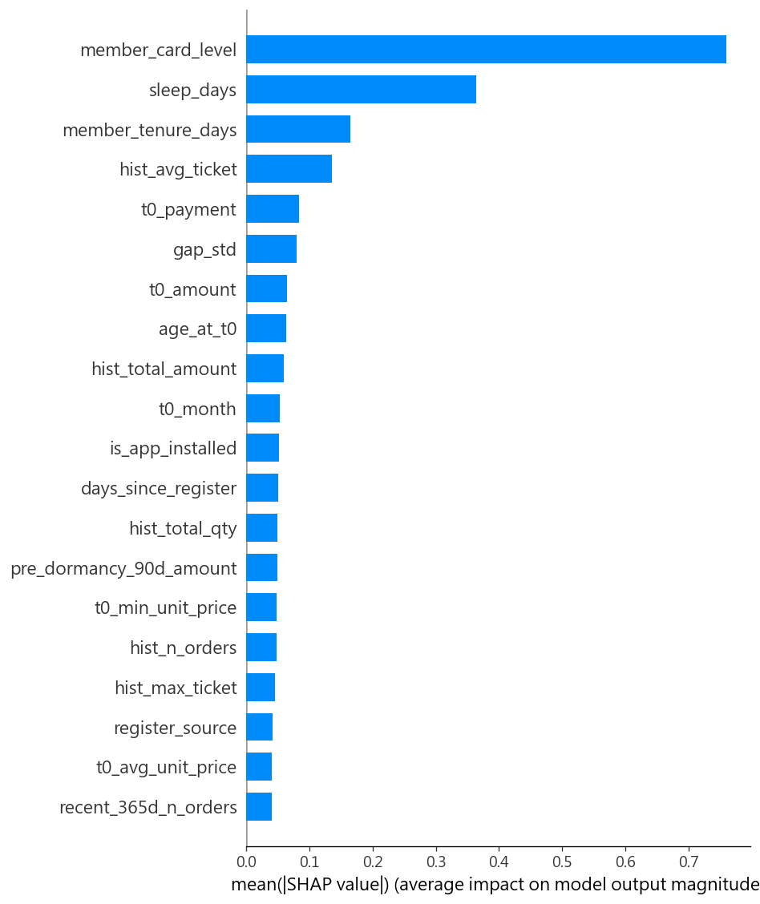

# 真復活預測模型報告（第一版）

> 腳本：`modeling.py` — 2026-06-03
> 輸入：`output/train_features.csv` (198,370) /
> `output/test_features.csv` (89,454)

---

## 1. 模型設定

- 演算法：**XGBoost (XGBClassifier)**，預設參數
- `enable_categorical=True`、`tree_method='hist'`、`eval_metric='logloss'`
- `random_state=42`、`n_jobs=-1`
- **第一版未調超參、未加類別權重（scale_pos_weight）**
- 模型存檔：`output/model/xgb_model.json`（原生格式，可重載）

---

## 2. 特徵與編碼

- 進模型特徵數：**57**（排除識別碼 sample_id, label, split, member_id, t0_date, t0_trades_group_code；
  實際特徵檔僅含 sample_id/label，其餘皆為特徵）
- 類別特徵（8 個）：hist_main_channel, hist_main_payment, t0_channel, t0_payment, t0_shipping, register_source, gender, country_code
  - 採 XGBoost **原生 categorical**（`astype('category')`），缺失補 `'unknown'`
  - test 的 categories 對齊 train，未見類別 → NaN
- 數值特徵 NaN **保留不填**，由 XGBoost 原生處理
- 前置清理：`age_at_t0` 限 [10,100]、`days_since_register` 負值→NaN（壞 Birthday/快照偽影）

---

## 3. 評估結果

| 指標 | train | test |
|------|------:|-----:|
| AUC-ROC | 0.8271 | 0.7418 |
| AUC-PR | 0.9110 | 0.8093 |
| Brier Score | 0.1576 | 0.2045 |
| Precision (@0.5) | 0.8061 | 0.6871 |
| Recall (@0.5) | 0.8464 | 0.7608 |
| F1 (@0.5) | 0.8258 | 0.7221 |

**混淆矩陣 — train** `[[TN, FP], [FN, TP]]` = `[[38092, 27105], [20455, 112718]]`
**混淆矩陣 — test** `[[TN, FP], [FN, TP]]` = `[[21420, 17504], [12087, 38443]]`

---

## 4. SHAP 特徵重要性

**Top 15（mean |SHAP|）**

| 排名 | 特徵 | mean \|SHAP\| |
|---|---|---|
| 1 | member_card_level | 0.7606 |
| 2 | sleep_days | 0.3635 |
| 3 | member_tenure_days | 0.1642 |
| 4 | hist_avg_ticket | 0.1359 |
| 5 | t0_payment | 0.0839 |
| 6 | gap_std | 0.0796 |
| 7 | t0_amount | 0.0649 |
| 8 | age_at_t0 | 0.0636 |
| 9 | hist_total_amount | 0.0590 |
| 10 | t0_month | 0.0533 |
| 11 | is_app_installed | 0.0514 |
| 12 | days_since_register | 0.0504 |
| 13 | hist_total_qty | 0.0496 |
| 14 | pre_dormancy_90d_amount | 0.0487 |
| 15 | t0_min_unit_price | 0.0479 |

**Top 5 特徵方向性**

| 特徵 | 方向性（值高時） |
|---|---|
| member_card_level | corr(value, SHAP)=+0.98  → 機率上升 ↑ |
| sleep_days | corr(value, SHAP)=-0.79  → 機率下降 ↓ |
| member_tenure_days | corr(value, SHAP)=+0.65  → 機率上升 ↑ |
| hist_avg_ticket | corr(value, SHAP)=-0.72  → 機率下降 ↓ |
| t0_payment | 類別特徵（見 beeswarm 分佈） |

**SHAP 排序 vs gain 排序（Top10 重疊 4/10）**

| 排名 | SHAP Top10 | gain Top10 |
|---|---|---|
| 1 | member_card_level | member_card_level |
| 2 | sleep_days | t0_payment |
| 3 | member_tenure_days | t0_shipping |
| 4 | hist_avg_ticket | t0_n_distinct_salepages |
| 5 | t0_payment | sleep_days |
| 6 | gap_std | hist_avg_ticket |
| 7 | t0_amount | t0_channel |
| 8 | age_at_t0 | recent_180d_n_orders |
| 9 | hist_total_amount | recent_90d_n_orders |
| 10 | t0_month | recent_365d_n_orders |

---

## 5. 預測機率分佈

中機率客群 (0.4–0.6)：**31,952 筆**，佔 test 集 **35.7%**。
這群是行銷介入的主要目標（呼應 Proposal Q3 三層分群）。

---

## 6. 結果討論

- **train vs test AUC 差距 = 0.0853**：差距小，泛化穩定。
- 關注特徵的 SHAP 排名：

| 關注特徵 | SHAP 排名 |
|---|---|
| sleep_days | 2 |
| t0_buys_familiar_product | 49 |
| t0_vs_avg_ticket_ratio | 25 |
| sleep_vs_ci_ratio | 32 |
| t0_discount_vs_hist_ratio | 28 |

- 第一版限制：未調超參、未做機率校準、未處理 F5 極端比率值。

---

## 7. 下一步

1. **機率校準**（Isotonic / Platt）→ 改善 Brier、讓中機率分層更可信
2. **對照模型**：Logistic Regression / Random Forest 基準
3. **超參調整 + scale_pos_weight** 實驗（若 recall 偏低）
4. **F5 極端值 winsorize** 後重評特徵重要性
5. **子群分析**：Lost（沉睡<365d）vs Sealed（>365d）

*Generated by modeling.py — 2026-06-03*
